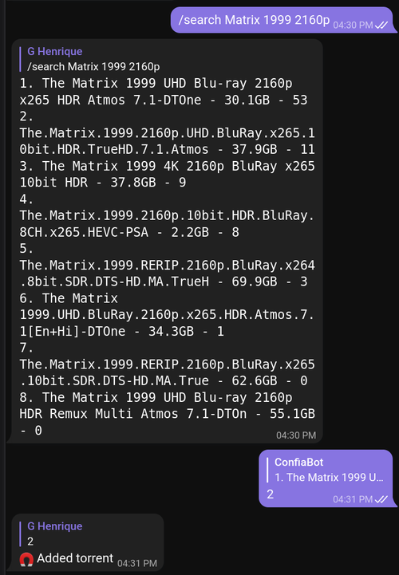
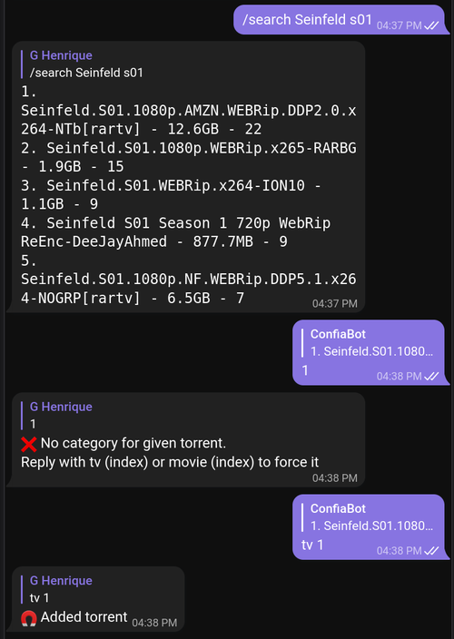
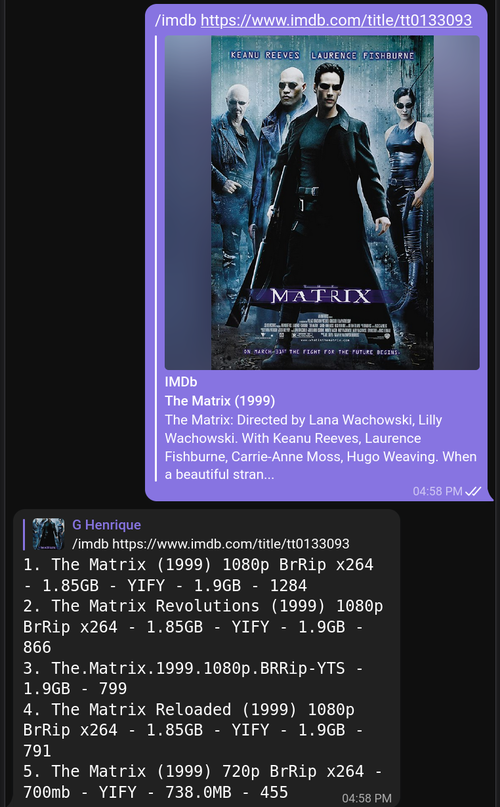
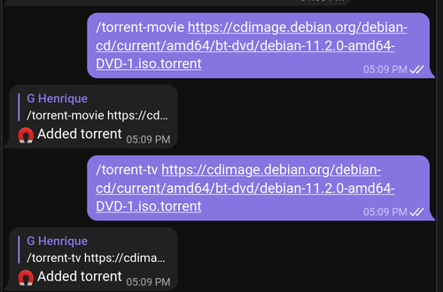

# telegram-bot-torrents

Telegram Bot to search by torrents in [Jackett](https://github.com/Jackett/Jackett) indexers and forward it to [Transmission](https://transmissionbt.com/).

## Features

It's possible to communicate with the bot in a group or privately.
By default, only movies and TV shows destination directories are supported.

### Add Movies
The format is `{Index}. {Name} - {Size} - {Seeds}` and the list is sorted by seeds.
Reply to the original message with the index of your prefered torrent.



### Add TV Shows
Jackett indexers split some torrents into [categories](https://github.com/Jackett/Jackett/wiki/Jackett-Categories).
But sometimes, a torrent might not have a TV or Movie category.
Specify the `tv` or `movie` command with the index when that happens.



### Add an IMDB page
Search the movie or TV show of the IMDB link. For example, `Matrix (1999)` is sent to Jackett.
An [OMDB key](http://www.omdbapi.com/apikey.aspx) is required.


### Send a direct torrent link

You can bypass Jackett, and add a torrent or a magnet link directly to the bot.



## Configuration
The bot is configured through some environment variables.

``` bash
# Token provided after creating a new bot https://core.telegram.org/bots#creating-a-new-bot
TELEGRAM_BOT_TOKEN=token
# Find the token in the field API Key
JACKETT_TOKEN=xyz
# Another option is to get the token directly passing the configuration folder
JACKETT_DATA_DIR=/home/user/.config/jackett
# Defaults to http://localhost:9117
JACKETT_URL=http://192.168.1.10:9117
# Only needed if /imdb command is issued
OMDB_TOKEN=xyz
# Directory where TV torrents are stored
TRANSMISSION_TV_PATH=/home/user/torrent/tv
# Directory where Movie torrents are stored
TRANSMISSION_MOVIE_PATH=/home/user/torrent/movies
# If transmission requires
TRANSMISSION_CREDENTIALS=admin:admin
# Defaults to http://localhost:9117
TRANSMISSION_URL=http://192.168.1.10:9091
# Allowed ids to talk with the bot
TELEGRAM_ALLOWED_GROUPS=1,2,3
```


## Security
The bot is open by default. This means any person can add any torrent to your bot (as long as they can find it in the first place).
To make it secure, add the chat id of the group or your own id to the  `TELEGRAM_ALLOWED_GROUPS` environment variable.
Issue the command `/chat-id`, and the bot will reply with your id.
After changing the variable `TELEGRAM_ALLOWED_GROUPS`, restart the server, and only the private chat or groups are allowed to talk with the bot.

## Running
Either run `cargo build` or with [cross](https://github.com/rust-embedded/cross) to build for other architectures.
Cross supports the compilation of [lots of different architectures](https://github.com/rust-embedded/cross#supported-targets)

``` bash
cargo build
./target/debug/telegram-bot-torrents

cargo build --release
./target/release/telegram-bot-torrents

cross build --release --target=armv7-unknown-linux-gnueabihf
./target/armv7-unknown-linux-gnueabihf/release/telegram-bot-torrents telegram-bot-torrents.linux.armv7
```
